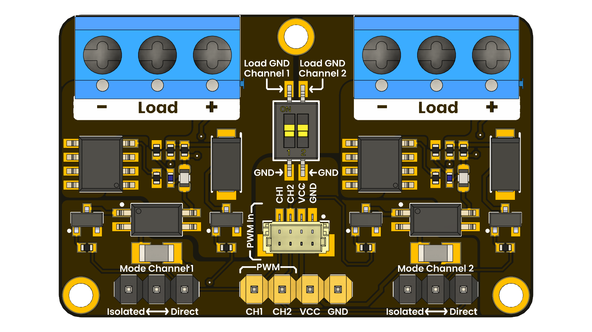

# UNIT PWM Module

## Introduction

The UNIT PWM Module is a compact, two-channel PCB designed to amplify pulse-width modulation signals from a microcontroller. It enables reliable switching of external loads at higher voltages and currents than the microcontroller can natively handle. With its clearly labeled screw-terminal connectors, the module is well-suited for motor speed control, high-power LED dimming, and other projects requiring precise power regulation via PWM. The board also includes a QWIIC-compatible 4-pin header, allowing for easy plug-and-play wiring and daisy-chaining of power and PWM signals using standard Qwiic cables.

    <a href="#">
         UNIT PWM Module
    </a>

### Quick Setup

## 📦 Overview

| Feature             | Details                                                 |
|---------------------|---------------------------------------------------------|
| 2-channel PWM       | Two independent channels for versatile control        |
| 5V logic            | Compatible with 3.3V and 5V microcontrollers            |
| 5V power supply     | Powers external devices up to 2A                        |
| Qwiic connector     | 4-pin connector for easy integration                   |

## 🧪 Use Cases

- Motor speed and direction control for DC motors
- Brightness control for high-power LEDs
- Temperature control for heating elements
- Efficient power regulation for various loads
- Amplifying PWM signals for long-distance transmission

## 📚 Resources

- [Pinout Diagram](hardware/resources/unit_pinout_v_0_0_1_ue0054_pwm_module_en.png)
- [Schematic Diagram](hardware/UE0083-SCH-Modulo_PWM-001-T.pdf)
- [Code Examples](software/examples)
- [Purchase Link](https://uelectronics.com/)

## 📝 License

All hardware and documentation in this project are licensed under the **MIT License**.  
Please refer to [`LICENSE.md`](LICENSE.md) for full terms.
