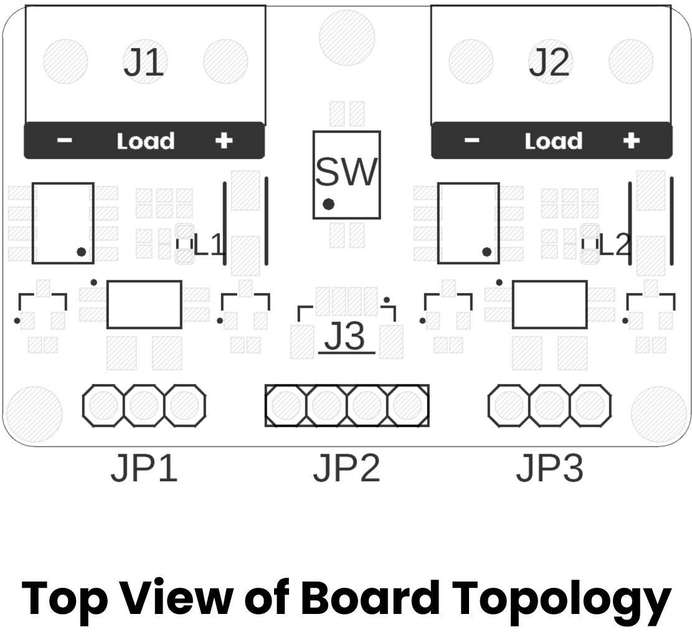
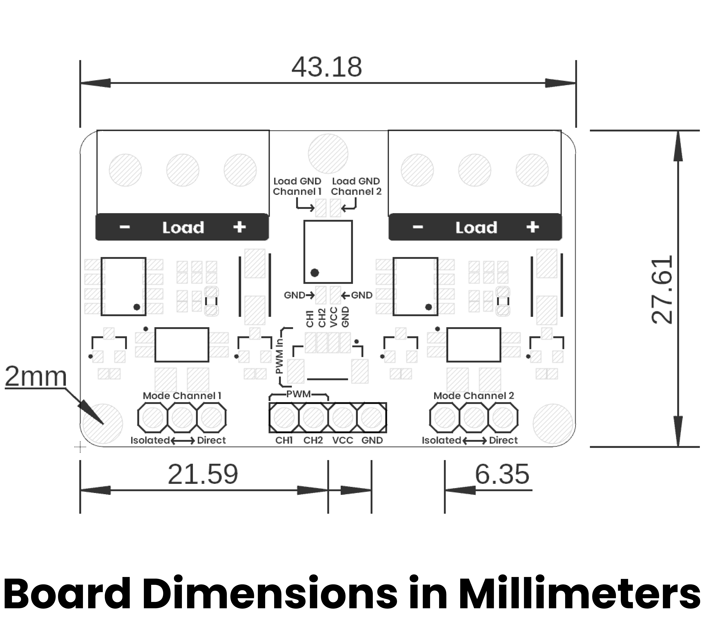

# Hardware

<a href="./unit_sch_v_0_0_1_ue0083_pwm_module.pdf">  Schematics</a>

## Key Technical Specifications

| **Parameter** |            **Description**            | **Min** | **Max** | **Unit** |
|:-------------:|:-------------------------------------:|:-------:|:-------:|:--------:|
|      Vin      | Input voltage to power on the module  |   3.3   |    5    |    V     |
|    V Load*    | Maximum voltage for the external load |    -    |   30    |    V     |
|    I Load*    | Maximum current for the external load |    -    |   15    |    A     |
|      P*       |         Maximum power at load         |    -    |   200   |    W     |

* A DIP switch is provided to couple or isolate the microcontroller ground from the load ground.
* Mode selection**: use jumper bridges to choose "Direct mode" (grounds coupled) or "Isolated mode" (grounds isolated) for improved protection.

***These values were tested at 1 kHz. Performance may vary at other frequencies.**

****Use the jumper bridges and the DIP switch to change between Direct and Isolated modes.**

## Pinout

<a href="./unit_pinout_v_0_0_2_ue0083_pwm_module_en.pdf">  Pinout</a>
  

| Channel           | Description                                                                           | Control Pins | Power Pins | Load Terminals | Typical Use                           |
|-------------------|---------------------------------------------------------------------------------------|--------------|------------|----------------|---------------------------------------|
| **PWM Channel 1** | MOSFET-based driver that amplifies MCU’s PWM output to switch a heavier external load | PWM1, GND    | VCC1, GND  | Load1          | DC motors, high-power LEDs, solenoids |
| **PWM Channel 2** | Identical high-current PWM driver on a second channel                                 | PWM2, GND    | VCC2, GND  | Load2          | Same as Channel 1                     |

 

## Topology

<a href="./resources/unit_topology_v_0_0_1_ue0083_PWM-Module.png">  Topology</a>

| Ref.  | Description                                                                 |
|-------|-----------------------------------------------------------------------------|
| SW    | Dip Switch for coupling grounds                                             |
| L1    | Channel 1 PWM LED                                                           |
| L2    | Channel 2 PWM LED                                                           |
| J1    | Screw Terminal Block for Channel 1 Load                                     |
| J2    | Screw Terminal Block for Channel 2 Load                                     |
| J3    | JST 1mm Connector for input signals                                         |
| JP1   | Header for Channel 1 mode selection                                         |
| JP2   | Header for input signals                                                    |
| JP3   | Header for Channel 2 mode selection                                         |

## Dimensions

<a href="./resources/unit_dimension_v_0_0_1_ue0083_PWM-Module.png">  Dimensions</a>

