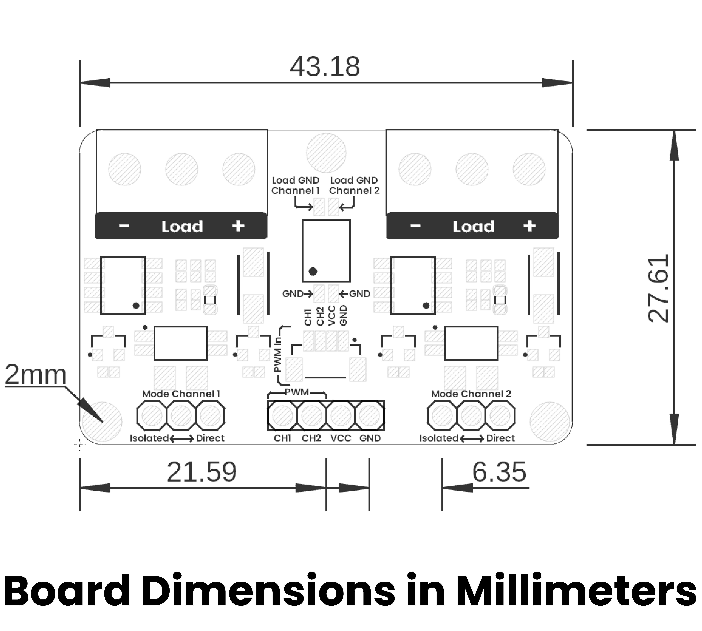
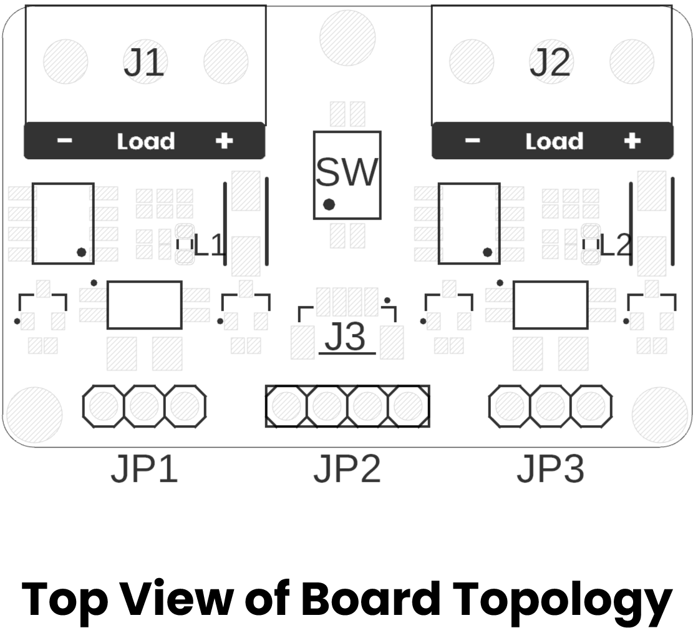

# Hardware

<a href="./unit_schematic_v_0_0_1_ue0083_PWM-Module.pdf">  Schematics</a>

# Pinout

<a href="#">  Pinout</a>
  

| Channel          | Description                                         | Control Pins   | Power Pins      | Load Terminals             | Typical Use                          |
|------------------|-----------------------------------------------------|----------------|-----------------|----------------------------|--------------------------------------|
| **PWM Channel 1**| MOSFET-based driver that amplifies MCU’s PWM output to switch a heavier external load | PWM1, GND      | VCC1, GND       | Load1     |    DC motors, high-power LEDs, solenoids |
| **PWM Channel 2**| Identical high-current PWM driver on a second channel | PWM2, GND      | VCC2, GND       | Load2        | Same as Channel 1                    |

 

# Dimensions

<a href="./resources/unit_dimension_v_0_0_1_ue0083_PWM-Module.png">  Dimensions</a>

# Topology

<a href="./resources/unit_topology_v_0_0_1_ue0083_PWM-Module.png">  Topology</a>

| Ref.  | Description                                                                 |
|-------|-----------------------------------------------------------------------------|
| SW    | Dip Switch for coupling grounds                                             |
| L1    | Channel 1 PWM LED                                                           |
| L2    | Channel 2 PWM LED                                                           |
| J1    | Screw Terminal Block for Channel 1 Load                                     |
| J2    | Screw Terminal Block for Channel 2 Load                                     |
| J3    | JST 1mm Connector for input signals                                         |
| JP1   | Header for Channel 1 mode selection                                         |
| JP2   | Header for input signals                                                    |
| JP3   | Header for Channel 2 mode selection                                         |

