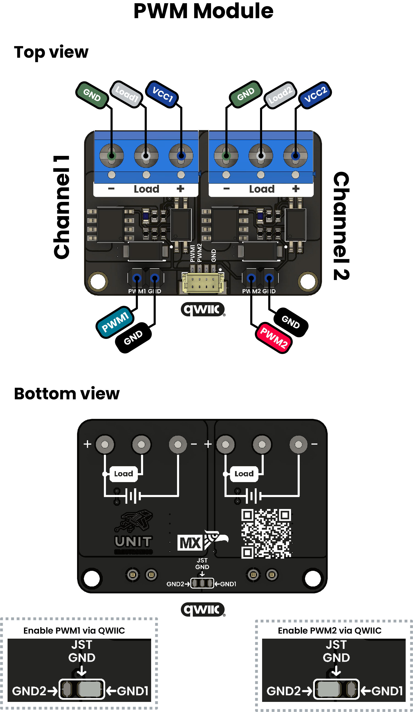

# Hardware

<a href="#">  Schematics</a>

# Pinout

<a href="#">  Pinout</a>

* **PWM Inputs**

PWM1 and PWM2: logic-level lines driven by two separate PWM pins on your microcontroller (e.g. STM32, ESP32, Arduino).

Each input feeds through an isolation/level-shift stage (opto­coupler) that protects the MCU.

* **External Power Supply**

Screw terminals labeled “–” (GND) and “+” (V+) on each channel accept DC voltages _ .

* **Common Ground Reference**

The GND pin beside the PWM inputs must be tied to the microcontroller’s ground to establish a shared reference and ensure reliable signal detection.
