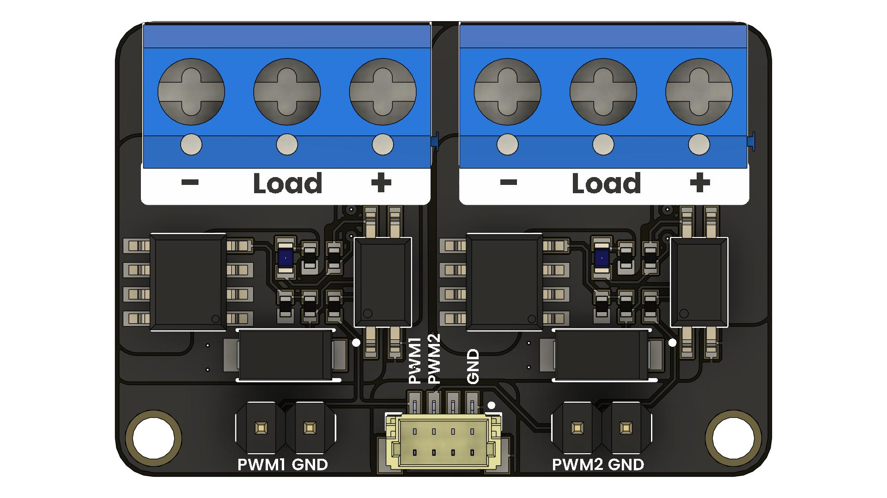
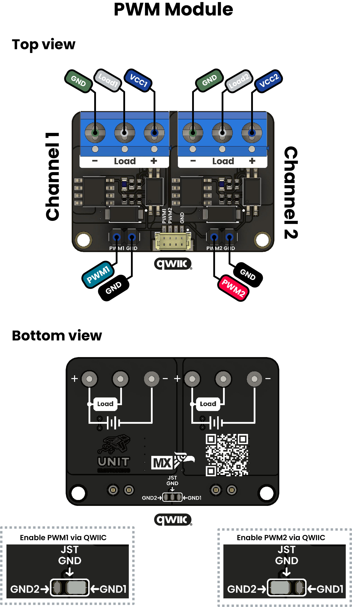

<!--
# README_TEMPLATE.md
Este archivo sirve como entrada para generar un PDF técnico estilo datasheet.
Edita las secciones respetando el orden, sin eliminar los encabezados.
-->
 <!-- logo -->

# PWM Module

## Introduction

This two-channel PWM module PCB is purpose-built to amplify pulse-width modulation signals from a microcontroller, allowing it to switch external loads at voltages and currents well beyond the device’s native limits. Its compact design, featuring clearly labeled screw-terminal connectors, is ideal for applications such as motor speed control, high-power LED dimming, or any project requiring precise PWM regulation. Additionally, a JST 1mm 4 vias header is included for convenient plug-and-play wiring and daisy-chaining of power and PWM signals.

## Functional Description

- The module is designed to extend the PWM capabilities of microcontrollers, enabling them to control high-power loads such as motors or LEDs.
- It features two independent channels, each with its own input and output control.
- The input control accepts PWM signals from the microcontroller, while the output control drives the connected load.
- The module is equipped with a JST 1mm 4 vias header for easy connection to power and PWM signals.

## Electrical Characteristics & Signal Overview

- 

## Applications

- The module is suitable for applications requiring high-power PWM control, such as:
- Motor speed control
- High-power LED dimming
- Any project requiring precise PWM regulation
- The module can be used in robotics, automation, and other projects where high-power loads need to be controlled with precision.

## Features

- The module contains two devices that share the same features but are connected to separate input and output controls, allowing for independent operation.

## Pin & Connector Layout

| Device | Input Control               | Output Control                | Features                                               |
|--------|-----------------------------|-------------------------------|--------------------------------------------------------|
| PWM 1  | Dedicated input for control | Dedicated output for driving  | MOSFET driver with precise control and transient protection |
| PWM 2  | Dedicated input for control | Dedicated output for driving  | MOSFET driver with precise control and transient protection |

## Settings

### Interface Overview

| Interface  | Signals / Pins            | Typical Use                                         |
|------------|----------------------------|-----------------------------------------------------|
| -       | - | -      |

### Supports 

| Symbol | I/O   | Description                         |
| ------ | ----- | ----------------------------------- |
| VCC    | Input | Power supply (3.3V or 5V)           |

## Block Diagram

## Dimensions

## Usage

Works with:

- 

## Downloads

- [Schematic PDF](docs/schematic.pdf)

## Purchase

- [Buy from UNIT Electronics](https://www.uelectronics.com)
